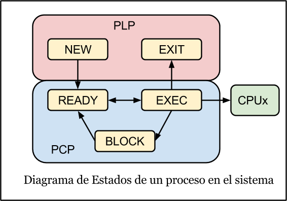

Está Coverflow - Fé de erratas
==============================

* En el archivo de configuración de la UMV falta el tamaño del bloque de memoria que funcionará como memoria principal.
* En el archivo de configuración del Kernel falta la IP/Puerto de la UMV.
* El enunciado del TP dice que el Stack tiene un tamaño fijo de 100 bytes. Lo correcto es que el tamaño del Stack sea configurable por archivo de configuración.
* En el archivo de configuración del Kernel faltan las variables globales.
* El “Diagrama de Estados de un proceso en el sistema” tiene una transición de más desde Ready hacia el PLP. El Diagrama corregido es el siguiente:

* En la lista de tareas a realizar del PCP dice:
> Recibirá los PCB del PLP y los encolará en la cola de READY, según el algoritmo de planificación de corto plazo Round Robin.

 Dado que es el PLP el encargado de transicionar Programas de New a Ready, esta tarea debería decir:
 > Planificará según el algoritmo Round Robin a los procesos encolados en la cola de READY.

* Página 7, `System Calls`:
 >En el código Ansisop el identificador de la variable compartida, para diferenciarlo de las variables normales, comenzará con el caracter signo de admiración (!), seguido del identificador de un caracter alfabético, por ejemplo: !a, !g, !q

 La restricción de un único caracter alfabético es incorrecta. Las variables globales se identifican con un `!` y luego una cadena alfanumérica, como correctamente dice la página 18. Por ejemplo, `!a`, `!A`, `!compartida`, `!ParaTodos`, `!Compartidas10`.
